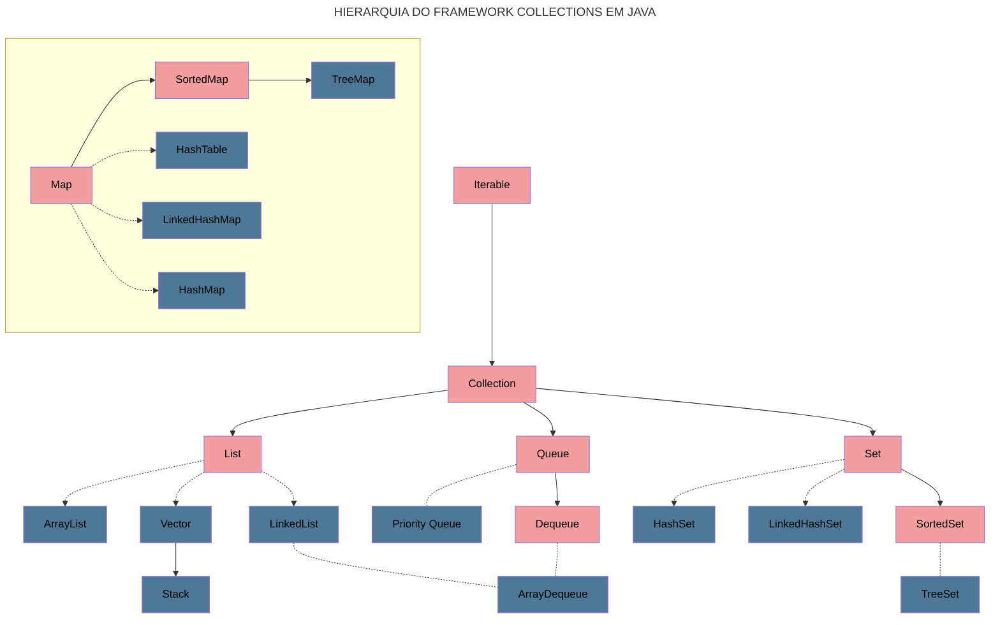

# collections-java-api 

---

```mermaid
---
title: HIERARQUIA DO FRAMEWORK COLLECTIONS EM JAVA
---
flowchart TB
    id1["Iterable"]
    id2["Collection"]
    id3["List"]
    id4["Queue"]
    id5["Set"]
    id6["ArrayList"]
    id7["LinkedList"]
    id8["Vector"]
    id9["Stack"]
    id10["Priority Queue"]
    id11["Dequeue"]
    id12["ArrayDequeue"]
    id13["HashSet"]
    id14["LinkedHashSet"]
    id15["SortedSet"]
    id16["TreeSet"]
    id17["Map"]
    id18["SortedMap"]
    id19["TreeMap"]
    id20["HashTable"]
    id21["LinkedHashMap"]
    id22["HashMap"]

    id1 --> id2
    id2 --> id3 & id4 & id5
    id3 -.-> id6 & id8 & id7
    id8 --> id9
    id4 -.- id10
    id4 --> id11
    id7 & id11 -.- id12
    id5 -.-> id13 & id14
    id5 --> id15
    id15 -.- id16
    subgraph " "
        direction LR
        id17 --> id18 --> id19
        id17 -.-> id20 & id21 & id22
    end

    style id1 fill:#F29E9E,color:#000000
    style id2 fill:#F29E9E,color:#000000
    style id3 fill:#F29E9E,color:#000000
    style id4 fill:#F29E9E,color:#000000
    style id5 fill:#F29E9E,color:#000000
    style id11 fill:#F29E9E,color:#000000
    style id15 fill:#F29E9E,color:#000000
    style id17 fill:#F29E9E,color:#000000
    style id18 fill:#F29E9E,color:#000000

    style id6 fill:#4E7896,color:#000000
    style id7 fill:#4E7896,color:#000000
    style id8 fill:#4E7896,color:#000000
    style id9 fill:#4E7896,color:#000000
    style id10 fill:#4E7896,color:#000000
    style id12 fill:#4E7896,color:#000000
    style id13 fill:#4E7896,color:#000000
    style id14 fill:#4E7896,color:#000000
    style id16 fill:#4E7896,color:#000000
    style id19 fill:#4E7896,color:#000000
    style id20 fill:#4E7896,color:#000000
    style id21 fill:#4E7896,color:#000000
    style id22 fill:#4E7896,color:#000000
```

---

https://github.com/cami-la/collections-java-api-2023
