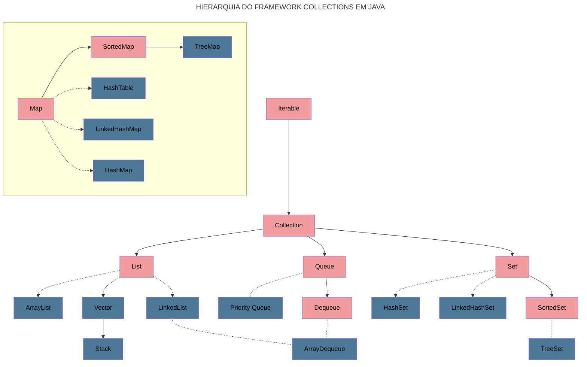

# collections-java-api 
#### Olá, _Javeiros_! Que tal falarmos sobre Collection?
#### Uma Collection (coleção) é uma estrutura de dados que agrupa vários elementos em uma única unidade, permitindo que eles sejam manipulados de forma eficiente. Esses elementos precisam ser objetos e, em geral, trabalhamos com coleções homogêneas, ou seja, com elementos de um tipo específico. No entanto, coleções heterogêneas também são possíveis, dependendo da necessidade da aplicação.

#### O núcleo das coleções em Java é formado por um conjunto de interfaces que definem a estrutura e o comportamento de diferentes tipos de coleções, facilitando a manipulação dos dados sem precisar conhecer os detalhes de implementação. Todas essas interfaces e classes estão no pacote `java.util`.

#### Existem quatro grandes tipos de coleções em Java:

- **List (lista):** Armazena elementos de forma ordenada e permite elementos duplicados. Exemplos incluem `ArrayList`, `LinkedList` e `Vector`.

- **Set (conjunto):** Garante que não haja elementos duplicados e não necessariamente mantém a ordem de inserção. Exemplos incluem `HashSet`, `LinkedHashSet` e `TreeSet`.

- **Queue (fila):** Armazena elementos em uma ordem específica, geralmente usada para processamento sequencial. Exemplos incluem `LinkedList` e `PriorityQueue`.

- **Map (mapa):** Armazena pares chave-valor. Embora não seja diretamente uma subinterface de Collection, ela é considerada parte do conjunto de coleções devido à sua utilidade. Exemplos incluem `HashMap`, `TreeMap` e `LinkedHashMap`.

#### A seguir é apresentado um fluxograma representativo da hierarquia de collections em Java.

---

> Legenda:
> 
> 
> 
> 
> 

---

# Conclusão
#### As Collections em Java são tipo o canivete suíço pra quem lida com dados. Elas deixam tudo mais fácil e prático quando o assunto é organizar, buscar e processar grandes quantidades de informações. Quer armazenar dados de forma rápida? Pode usar um `ArrayList`. Precisa garantir que não tem duplicatas? Um `HashSet` resolve. Quer trabalhar com pares chave-valor? Adiciona um `HashMap` na jogada! Cada implementação tem suas vantagens, e dá pra escolher a que melhor se encaixa na situação, seja pra buscar algo rapidinho, remover elementos ou evitar duplicatas.

---

### _Gostou do meu perfil? Você pode saber mais sobre mim em:_ &nbsp;&nbsp;
### _Ou me contatar através do:_ &nbsp;&nbsp;
### _Referências:_
[1] Repositório base DIO. Disponível em: https://github.com/cami-la/collections-java-api-2023

[2] Static Badge | Shields.io. Disponível em: https://shields.io/badges

[3] Flowcharts Syntax | Mermaid. Disponível em: http://mermaid.js.org/syntax/flowchart.html#comment-curly-brace
